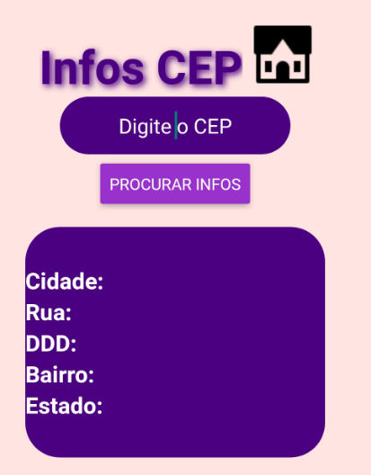

<h1 align='center'>
    APP - InfosCEP
</h1>

# ⏩ Preview

# 📝 Sobre

O projeto **InfosCEP** é um simples app desenvolvido no intuito de começar a aprender react native. É um simples app com uma caixa de texto,
no qual você digita um CEP e ele retorna algumas informações do mesmo.

## 💻Tecnologias utilizadas

- [React Native](https://reactnative.dev/)
- [Awesomeapi](https://docs.awesomeapi.com.br/)
